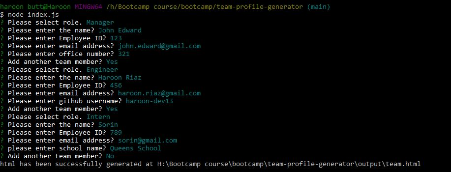
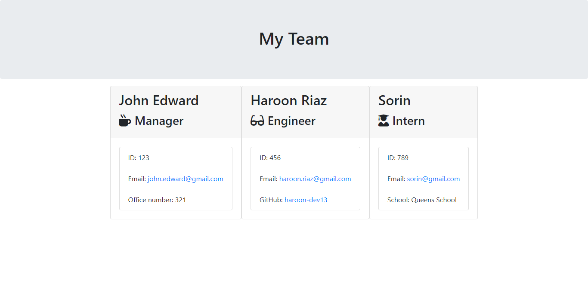

# Team Profile Generator
  

## Description
Team Profile Generator is a dynamic application in which user answers the questions and team profile will be generated.  
Here is the deployed app link [Team Profile Generator](https://haroon-dev13.github.io/team-profile-generator/).
## Table of Contents
* [Installation](#installation)
* [Usage](#usage)
* [License](#license)

## Installation
To use this Application you should have "node" installed in your system and also install the the required packages that are mentioned in package.json file by using this command "npm install" in terminal.

## Usage
To use this application, run the index.js file by using command "node index.js" in terminal. This application asked some question about the team and you have to answer those question and then this will gererate the team profile.

### Terminal View

### Team OutPut

## License
Copyright (c) 2023 [Haroon-Dev13](https://github.com/Haroon-Dev13)
